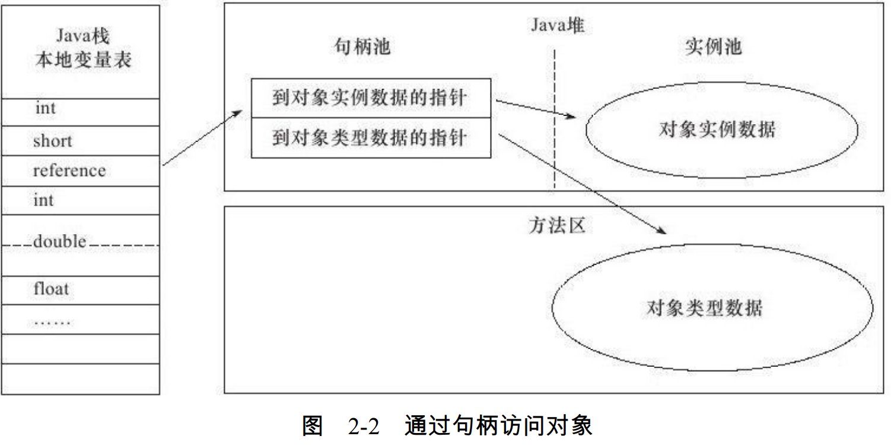
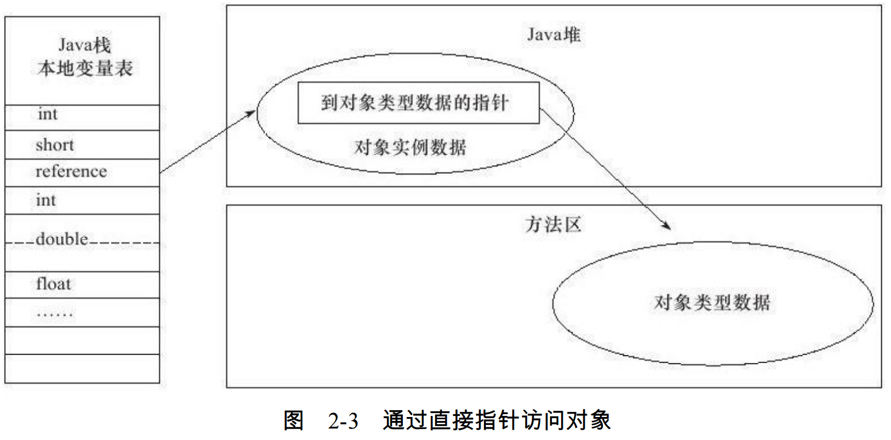
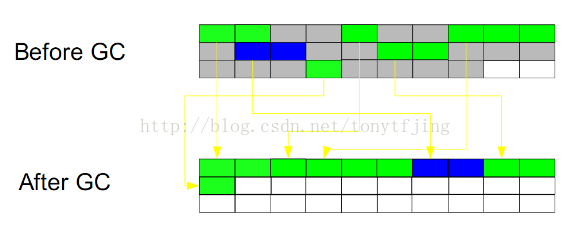
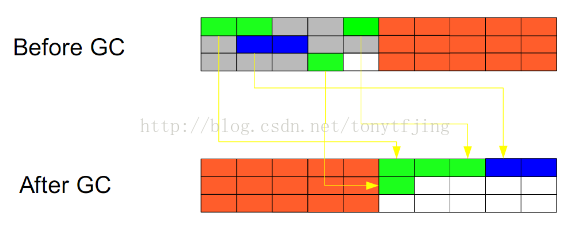
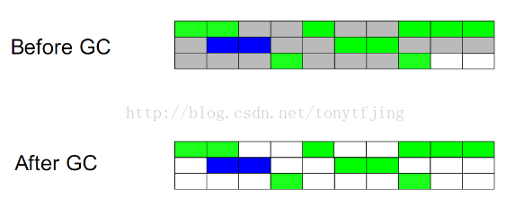
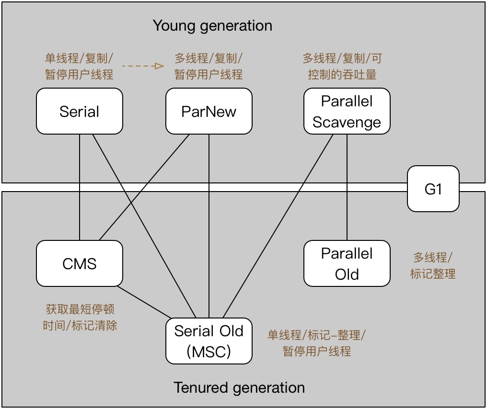

# 第二章 JAVA内存区域与内存溢出异常
### 2.2 运行时数据区域
#### 2.2.1 程序计数器
程序计数器（Program Counter Register）是一块较小的内存空间，它可以看作是当前线程所执行的字节码的行号指示器

由于Java虚拟机的多线程是通过线程轮流切换并分配处理器执行时间的方式来实现的，
在任何一个确定的时刻，一个处理器（对于多核处理器来说是一个内核）都只会执行一条线
程中的指令。因此，为了线程切换后能恢复到正确的执行位置，每条线程都需要有一个独立
的程序计数器，各条线程之间计数器互不影响，独立存储，我们称这类内存区域为“线程私
有”的内存。

如果线程正在执行的是一个Java方法，这个计数器记录的是正在执行的虚拟机字节码指
令的地址；如果正在执行的是Native方法，这个计数器值则为空（Undefined）。此内存区域
是唯一一个在Java虚拟机规范中没有规定任何OutOfMemoryError情况的区域
#### 2.2.2 JAVA虚拟机栈
虚拟机栈描述的是Java方法执行的内存模型：每个方法在执行的同时
都会创建一个栈帧（Stack Frame）用于存储局部变量表、操作数栈、动态链接、方法出口
等信息。每一个方法从调用直至执行完成的过程，就对应着一个栈帧在虚拟机栈中入栈到出栈的过程

如果线程请求的栈深度大于虚拟机所允许的深度，将抛出StackOverflowError异常；如果虚拟机栈可以动态扩展（当前大部
分的Java虚拟机都可动态扩展，只不过Java虚拟机规范中也允许固定长度的虚拟机栈），如
果扩展时无法申请到足够的内存，就会抛出OutOfMemoryError异常
#### 2.2.3 本地方法栈
本地方法栈（Native Method Stack）与虚拟机栈所发挥的作用是非常相似的，它们之间
的区别不过是虚拟机栈为虚拟机执行Java方法（也就是字节码）服务，而本地方法栈则为虚
拟机使用到的Native方法服务。
#### 2.2.4 JAVA堆
Java堆（Java Heap）是Java虚拟机所管理的内存中最大的一块。
Java堆是被所有线程共享的一块内存区域，在虚拟机启动时创建。此内存区域的唯一目的就
是存放对象实例，几乎所有的对象实例都在这里分配内存

根据Java虚拟机规范的规定，Java堆可以处于物理上不连续的内存空间中，只要逻辑上
是连续的即可，就像我们的磁盘空间一样
#### 2.2.5 方法区
方法区（Method Area）与Java堆一样，是各个线程共享的内存区域，它用于存储已被虚
拟机加载的类信息、常量、静态变量、即时编译器编译后的代码等数据。

对于习惯在HotSpot虚拟机上开发、部署程序的开发者来说，很多人都更愿意把方法区
称为“永久代”（Permanent Generation），本质上两者并不等价，仅仅是因为HotSpot虚拟机的
设计团队选择把GC分代收集扩展至方法区，或者说使用永久代来实现方法区而已，这样
HotSpot的垃圾收集器可以像管理Java堆一样管理这部分内存，能够省去专门为方法区编写内
存管理代码的工作。对于其他虚拟机（如BEA JRockit、IBM J9等）来说是不存在永久代的概
念的。

这区域的内存回收目标主要是针对常量池的回收和对类型的卸载

`运行时常量池`（Runtime Constant Pool）是方法区的一部分。Class文件中除了有类的版
本、字段、方法、接口等描述信息外，还有一项信息是常量池（Constant Pool Table），用于
存放编译期生成的各种字面量和符号引用，这部分内容将在类加载后进入方法区的运行时常量池中存放

并非预置入Class文件中常量池的内容才能进入方法区运行时常量池，运行期间也可能将新的常量放入池中,比如String类的intern()方法

#### 2.2.7 直接内存
直接内存（Direct Memory）并不是虚拟机运行时数据区的一部分，也不是Java虚拟机规
范中定义的内存区域。但是这部分内存也被频繁地使用，而且也可能导致OutOfMemoryError异常出现

本机直接内存的分配不会受到Java堆大小的限制，但是，既然是内存，肯定还是
会受到本机总内存（包括RAM以及SWAP区或者分页文件）大小以及处理器寻址空间的限
制。服务器管理员在配置虚拟机参数时，会根据实际内存设置-Xmx等参数信息，但经常忽略
直接内存，使得各个内存区域总和大于物理内存限制（包括物理的和操作系统级的限制），
从而导致动态扩展时出现OutOfMemoryError异常

### 2.3 Hotspot虚拟机对象探秘
#### 2.3.1 对象的创建
语言层面上，创建对象（例如克隆、反序列化）通常仅仅是一个new关键字而已，在虚拟机中，
对象（文中讨论的对象限于普通Java对象，不包括数组和Class对象等）的创建过程如下：
1. 检查这个指令的参数是否能在常量池中定位到一个类的符号引用，并且检查这个符号引用代
表的类是否已被加载、解析和初始化过。如果没有，那必须先执行相应的类加载过程
2. 为新生对象分配内存（参考后续介绍），对象所需内存的大小在类加载完成后便可完全确定，
为对象分配空间的任务等同于把一块确定大小的内存从Java堆中划分出来。
3. 将分配到的内存空间都初始化为零值（不包括对象头），如果使用TLAB，这一工作过程也可以提前至TLAB分配时进行
4. 对对象进行必要的设置：例如这个对象是哪个类的实例、如何才能找
到类的元数据信息、对象的哈希码、对象的GC分代年龄等信息。这些信息存放在对象的对
象头（Object Header）之中。根据虚拟机当前的运行状态的不同，如是否启用偏向锁等，对象头会有不同的设置方式。
5. 在上面工作都完成之后，从虚拟机的视角来看，一个新的对象已经产生了，但从Java程
   序的视角来看，对象创建才刚刚开始——＜init＞方法还没有执行，所有的字段都还为零。
   所以，一般来说（由字节码中是否跟随invokespecial指令所决定），执行new指令之后会接着
   执行＜init＞方法，把对象按照程序员的意愿进行初始化，这样一个真正可用的对象才算完
   全产生出来

`第2步内存分配：`
所有用过的内存都放在一边，空闲的内存放在另一边，中间放着一个指针作为分界点的指示器，那所分配
内存就仅仅是把那个指针向空闲空间那边挪动一段与对象大小相等的距离，这种分配方式称为“指针碰撞”（Bump the Pointer）。
如果Java堆中的内存并不是规整的，已使用的内存和空闲的内存相互交错，那就没有办法简单地进行指针碰撞了，虚拟机就必须维护一个列表，记
录上哪些内存块是可用的，在分配的时候从列表中找到一块足够大的空间划分给对象实例，并更新列表上的记录，这种分配方式称为“空闲列表”（Free List）。
选择哪种分配方式由Java堆是否规整决定，而Java堆是否规整又由所采用的垃圾收集器是否带有压缩整理功能决
定。因此，在使用Serial、ParNew等带Compact过程的收集器时，系统采用的分配算法是指针碰撞，而使用CMS这种基于Mark-Sweep算法的收集器时，通常采用空闲列表

除如何划分可用空间之外，还有另外一个需要考虑的问题是对象创建在虚拟机中是非常
频繁的行为，即使是仅仅修改一个指针所指向的位置，在并发情况下也并不是线程安全的，
可能出现正在给对象A分配内存，指针还没来得及修改，对象B又同时使用了原来的指针来
分配内存的情况。解决这个问题有两种方案，一种是对分配内存空间的动作进行同步处理
——实际上虚拟机采用CAS配上失败重试的方式保证更新操作的原子性；另一种是把内存分
配的动作按照线程划分在不同的空间之中进行，即每个线程在Java堆中预先分配一小块内
存，称为本地线程分配缓冲（Thread Local Allocation Buffer,TLAB）。哪个线程要分配内
存，就在哪个线程的TLAB上分配，只有TLAB用完并分配新的TLAB时，才需要同步锁定。
虚拟机是否使用TLAB，可以通过-XX：+/-UseTLAB参数来设定。

#### 2.3.2 对象的内存布局
在HotSpot虚拟机中，对象在内存中存储的布局可以分为3块区域：对象头（Header）、实例数据（Instance Data）和对齐填充（Padding）。

HotSpot虚拟机的对象头包括两部分信息，第一部分用于存储对象自身的运行时数据，
如哈希码（HashCode）、GC分代年龄、锁状态标志、线程持有的锁、偏向线程ID、偏向时
间戳等，这部分数据的长度在32位和64位的虚拟机（未开启压缩指针）中分别为32bit和64bit，官方称它为“Mark Word”。


对象头的另外一部分是类型指针，即对象指向它的类元数据的指针，虚拟机通过这个指针来确定这个对象是哪个类的实例
```
markOop.cpp片段
//Bit-format of an object header（most significant first,big endian layout below）：
//32 bits：
//--------
//hash：25------------＞|age：4 biased_lock：1 lock：2（normal object）
//JavaThread*：23 epoch：2 age：4 biased_lock：1 lock：2（biased object）
//size：32------------------------------------------＞|（CMS free block）
//PromotedObject*：29----------＞|promo_bits：3-----＞|（CMS promoted object）
```

接下来的实例数据部分是对象真正存储的有效信息，也是在程序代码中所定义的各种类型的字段内容。

第三部分对齐填充并不是必然存在的，也没有特别的含义，它仅仅起着占位符的作用。
由于HotSpot VM的自动内存管理系统要求对象起始地址必须是8字节的整数倍，换句话说，
就是对象的大小必须是8字节的整数倍。而对象头部分正好是8字节的倍数（1倍或者2倍），
因此，当对象实例数据部分没有对齐时，就需要通过对齐填充来补全

#### 2.3.3 对象的访问定位
Java程序需要通过栈上的reference数据来操作堆上的
具体对象。由于reference类型在Java虚拟机规范中只规定了一个指向对象的引用，并没有定
义这个引用应该通过何种方式去定位、访问堆中的对象的具体位置，所以对象访问方式也是取决于虚拟机实现而定的。

如果使用句柄访问的话，那么Java堆中将会划分出一块内存来作为句柄池，reference中
存储的就是对象的句柄地址，而句柄中包含了对象实例数据与类型数据各自的具体地址信息



如果使用直接指针访问，那么Java堆对象的布局中就必须考虑如何放置访问类型数据的相关信息，而reference中存储的直接就是对象地址



这两种对象访问方式各有优势，使用句柄来访问的最大好处就是reference中存储的是稳
定的句柄地址，在对象被移动（垃圾收集时移动对象是非常普遍的行为）时只会改变句柄中
的实例数据指针，而reference本身不需要修改


### 2.4 实战OutOfMemoryError异常
除了程序计数器外，虚拟机内存的其他几个运行时区域都有发生OutOfMemoryError（下文称OOM）异常的可能
###### JAVA堆溢出
参数-XX：+HeapDumpOnOutOfMemoryError可以让虚拟机在出现内存溢出异常时Dump出当前的内存堆转储快照以便事后进行分析[

###### 虚拟机栈和本地方法栈溢出
如果线程请求的栈深度大于虚拟机所允许的最大深度，将抛出StackOverflowError异常。

如果虚拟机在扩展栈时无法申请到足够的内存空间，则抛出OutOfMemoryError异常。

# 第三章 垃圾收集器与内存分配策略
what? when? how?3个问题

### 3.2 对象死了吗？
#### 3.2.1 引用计数法
给对象中添加一个引用计数器，每当有一个地方引用它时，计数器值就加1；当引用失效时，计数器值就减1；任何时刻计数器为0的对象就是不可能再被使用的。
#### 3.2.2 可达性分析方法
通过一系列的称为“GC Roots”的对象作为起始点，从这些节点开始向下搜索，搜索所
走过的路径称为引用链（Reference Chain），当一个对象到GC Roots没有任何引用链相连
（用图论的话来说，就是从GC Roots到这个对象不可达）时，则证明此对象是不可用的。

可作为GC Roots的对象包括下面几种：
- 虚拟机栈（栈帧中的本地变量表）中引用的对象。
- 方法区中类静态属性引用的对象。
- 方法区中常量引用的对象。
- 本地方法栈中JNI（即一般说的Native方法）引用的对象。

我们希望能描述这样一类对象：当内存空间还足够时，则能保留在内存之中；如果内存空间在进行垃圾收集后还是非常紧张，则可以抛弃这些对象
- 强引用就是指在程序代码之中普遍存在的，类似“Object obj=new Object（）”这类的引
用，只要强引用还存在，垃圾收集器永远不会回收掉被引用的对象。
- 软引用是用来描述一些还有用但并非必需的对象。对于软引用关联着的对象，在系统将
要发生内存溢出异常之前，将会把这些对象列进回收范围之中进行第二次回收。如果这次回
收还没有足够的内存，才会抛出内存溢出异常。在JDK 1.2之后，提供了SoftReference类来实
现软引用。
- 弱引用也是用来描述非必需对象的，但是它的强度比软引用更弱一些，被弱引用关联的
对象只能生存到下一次垃圾收集发生之前。当垃圾收集器工作时，无论当前内存是否足够，
都会回收掉只被弱引用关联的对象。在JDK 1.2之后，提供了WeakReference类来实现弱引
用。
- 虚引用也称为幽灵引用或者幻影引用，它是最弱的一种引用关系。一个对象是否有虚引
用的存在，完全不会对其生存时间构成影响，也无法通过虚引用来取得一个对象实例。为一
个对象设置虚引用关联的唯一目的就是能在这个对象被收集器回收时收到一个系统通知。在
JDK 1.2之后，提供了PhantomReference类来实现虚引用。

#### 3.2.4 生存还是死亡
即使在可达性分析算法中不可达的对象，也并非是“非死不可”的，这时候它们暂时处
于“缓刑”阶段，要真正宣告一个对象死亡，至少要经历两次标记过程：如果对象在进行可达
性分析后发现没有与GC Roots相连接的引用链，那它将会被第一次标记并且进行一次筛选，
筛选的条件是此对象是否有必要执行finalize（）方法。当对象没有覆盖finalize（）方法，或
者finalize（）方法已经被虚拟机调用过，虚拟机将这两种情况都视为“没有必要执行”。

如果这个对象被判定为有必要执行finalize（）方法，那么这个对象将会放置在一个叫做
F-Queue的队列之中，并在稍后由一个由虚拟机自动建立的、低优先级的Finalizer线程去执行
它。这里所谓的“执行”是指虚拟机会触发这个方法，但并不承诺会等待它运行结束，这样做
的原因是，如果一个对象在finalize（）方法中执行缓慢，或者发生了死循环（更极端的情
况），将很可能会导致F-Queue队列中其他对象永久处于等待，甚至导致整个内存回收系统
崩溃。

finalize（）方法是对象逃脱死亡命运的最后一次机会，稍后GC将对F-Queue中的对象
进行第二次小规模的标记，如果对象要在finalize（）中成功拯救自己——只要重新与引用链
上的任何一个对象建立关联即可，譬如把自己（this关键字）赋值给某个类变量或者对象的
成员变量，那在第二次标记时它将被移除出“即将回收”的集合；如果对象这时候还没有逃
脱，那基本上它就真的被回收了

任何`一个对象`的finalize（）方法都只会被系统自动调用一次，如果对象面临下一次回收，它的finalize（）方法不会被再次执行

#### 3.2.5 回收方法区
主要回收两部分内容：废弃常量和无用的类。回收废弃常量与回收Java堆中的对象非常类似

类需要同时满足下面3个条件才能算是“无用的类”：
- 该类所有的实例都已经被回收，也就是Java堆中不存在该类的任何实例。
- 加载该类的ClassLoader已经被回收。
- 该类对应的java.lang.Class对象没有在任何地方被引用，无法在任何地方通过反射访问该类的方法。

虚拟机可以对满足上述3个条件的无用类进行回收，这里说的仅仅是“可以”，而并不是
和对象一样，不使用了就必然会回收。是否对类进行回收，HotSpot虚拟机提供了-Xnoclassgc
参数进行控制，还可以使用-verbose：class以及-XX：+TraceClassLoading、-XX：
+TraceClassUnLoading查看类加载和卸载信息，其中-verbose：class和-XX：
+TraceClassLoading可以在Product版的虚拟机中使用，-XX：+TraceClassUnLoading参数需要
FastDebug版的虚拟机支持

### 3.3 垃圾回收算法
#### 3.3.1 标记-清除算法
最基础的收集算法是“标记-清除”（Mark-Sweep）算法，如同它的名字一样，算法分
为“标记”和“清除”两个阶段：首先标记出所有需要回收的对象，在标记完成后统一回收所有
被标记的对象，它的标记过程其实在前一节讲述对象标记判定时已经介绍过了。

不足有两个：一个是效率问题，标记和清除两个过程的效率都不高；另一个是
空间问题，标记清除之后会产生大量不连续的内存碎片，空间碎片太多可能会导致以后在程
序运行过程中需要分配较大对象时，无法找到足够的连续内存而不得不提前触发另一次垃圾收集动作


#### 3.3.2 复制算法
为了`解决效率问题`，一种称为“复制”（Copying）的收集算法出现了，它将可用内存按容
量划分为大小相等的两块，每次只使用其中的一块。当这一块的内存用完了，就将还存活着
的对象复制到另外一块上面，然后再把已使用过的内存空间一次清理掉。这样使得每次都是
对整个半区进行内存回收，内存分配时也就不用考虑内存碎片等复杂情况，只要移动堆顶指
针，按顺序分配内存即可，实现简单，运行高效。



#### 3.3.3 标记-整理算法
“标记-整理”（Mark-Compact）算法，标记过程
仍然与“标记-清除”算法一样，但后续步骤不是直接对可回收对象进行清理，而是让所有存
活的对象都向一端移动，然后直接清理掉端边界以外的内存



#### 3.3.4 分代收集算法
当前商业虚拟机的垃圾收集都采用“分代收集”（Generational Collection）算法，这种算
法并没有什么新的思想，只是根据对象存活周期的不同将内存划分为几块。一般是把Java堆
分为新生代和老年代，这样就可以根据各个年代的特点采用最适当的收集算法。在新生代
中，每次垃圾收集时都发现有大批对象死去，只有少量存活，那就选用复制算法，只需要付
出少量存活对象的复制成本就可以完成收集。而老年代中因为对象存活率高、没有额外空间
对它进行分配担保，就必须使用“标记—清理”或者“标记—整理”算法来进行回收。

### 3.4 HotSpot的算法实现
#### 3.4.1 枚举根节点
可达性分析对执行时间的敏感还体现在`GC停顿`上，因为这项分析工作必须在一
个能确保一致性的快照中进行——这里“一致性”的意思是指在整个分析期间整个执行系统看
起来就像被冻结在某个时间点上，不可以出现分析过程中对象引用关系还在不断变化的情
况，该点不满足的话分析结果准确性就无法得到保证。这点是导致GC进行时必须停顿所有
Java执行线程（Sun将这件事情称为“Stop The World”）的其中一个重要原因，即使是在号称
（几乎）不会发生停顿的CMS收集器中，枚举根节点时也是必须要停顿的。

由于目前的主流Java虚拟机使用的都是准确式GC（这个概念在第1章介绍Exact VM对
Classic VM的改进时讲过），所以当执行系统停顿下来后，并不需要一个不漏地检查完所有
执行上下文和全局的引用位置，虚拟机应当是有办法直接得知哪些地方存放着对象引用。在
HotSpot的实现中，是使用一组称为OopMap的数据结构来达到这个目的的，在类加载完成的
时候，HotSpot就把对象内什么偏移量上是什么类型的数据计算出来，在JIT编译过程中，也
会在特定的位置记录下栈和寄存器中哪些位置是引用。

#### 3.4.2 安全点
HotSpot也的确没有为每条指令都生成OopMap，前面已经提到，只是在“特定的
位置”记录了这些信息，这些位置称为安全点（Safepoint），即程序执行时并非在所有地方都
能停顿下来开始GC，只有在到达安全点时才能暂停。

Safepoint的选定既不能太少以致于让
GC等待时间太长，也不能过于频繁以致于过分增大运行时的负荷。所以，安全点的选定基
本上是以程序“是否具有让程序长时间执行的特征”为标准进行选定的——因为每条指令执行
的时间都非常短暂，程序不太可能因为指令流长度太长这个原因而过长时间运行，“长时间
执行”的最明显特征就是指令序列复用，例如方法调用、循环跳转、异常跳转等，所以具有
这些功能的指令才会产生Safepoint。

对于Sefepoint，另一个需要考虑的问题是如何在GC发生时让所有线程（这里不包括执行
JNI调用的线程）都“跑”到最近的安全点上再停顿下来。这里有两种方案可供选择：抢先式
中断（Preemptive Suspension）和主动式中断（Voluntary Suspension），其中抢先式中断不需
要线程的执行代码主动去配合，在GC发生时，首先把所有线程全部中断，如果发现有线程
中断的地方不在安全点上，就恢复线程，让它“跑”到安全点上。现在几乎没有虚拟机实现采
用抢先式中断来暂停线程从而响应GC事件。

而主动式中断的思想是当GC需要中断线程的时候，不直接对线程操作，仅仅简单地设
置一个标志，各个线程执行时主动去轮询这个标志，发现中断标志为真时就自己中断挂起。
轮询标志的地方和安全点是重合的，另外再加上创建对象需要分配内存的地方。下面代码清
单3-4中的test指令是HotSpot生成的轮询指令，当需要暂停线程时，虚拟机把0x160100的内存
页设置为不可读，线程执行到test指令时就会产生一个自陷异常信号，在预先注册的异常处
理器中暂停线程实现等待，这样一条汇编指令便完成安全点轮询和触发线程中断。

#### 3.4.3 安全区域
使用Safepoint似乎已经完美地解决了如何进入GC的问题，但实际情况却并不一定。
Safepoint机制保证了程序执行时，在不太长的时间内就会遇到可进入GC的Safepoint。但是，
程序“不执行”的时候呢？所谓的程序不执行就是没有分配CPU时间，典型的例子就是线程处
于Sleep状态或者Blocked状态，这时候线程无法响应JVM的中断请求，“走”到安全的地方去
中断挂起，JVM也显然不太可能等待线程重新被分配CPU时间。对于这种情况，就需要安全
区域（Safe Region）来解决。

安全区域是指在一段代码片段之中，引用关系不会发生变化。在这个区域中的任意地方
开始GC都是安全的。我们也可以把Safe Region看做是被扩展了的Safepoint。

在线程执行到Safe Region中的代码时，首先标识自己已经进入了Safe Region，那样，当
在这段时间里JVM要发起GC时，就不用管标识自己为Safe Region状态的线程了。在线程要离
开Safe Region时，它要检查系统是否已经完成了根节点枚举（或者是整个GC过程），如果完
成了，那线程就继续执行，否则它就必须等待直到收到可以安全离开Safe Region的信号为止
### 3.5 垃圾收集器
如果说收集算法是内存回收的方法论，那么垃圾收集器就是内存回收的具体实现。



#### 3.5.1 Serial收集器
是一个单线程的收集器，但它的“单线程”的意义并不仅仅说明它只会使用一个CPU或一条收集线程去完成垃圾收集工作，
更重要的是在它进行垃圾收集时，必须暂停其他所有的工作线程，直到它收集结束。“Stop
The World”这个名字也许听起来很酷，但这项工作实际上是由虚拟机在后台自动发起和自动
完成的，在用户不可见的情况下把用户正常工作的线程全部停掉，这对很多应用来说都是难以接受的。

简单而高效（与其他收集器的单线程比），对于限定单个
CPU的环境来说，Serial收集器由于没有线程交互的开销，专心做垃圾收集自然可以获得最高的单线程收集效率。


#### 3.5.2 ParNew收集器
ParNew收集器其实就是Serial收集器的多线程版本，除了使用多条线程进行垃圾收集之
外，其余行为包括Serial收集器可用的所有控制参数（例如：-XX：SurvivorRatio、-XX：
PretenureSizeThreshold、-XX：HandlePromotionFailure等）、收集算法、Stop The World、对
象分配规则、回收策略等都与Serial收集器完全一样，在实现上，这两种收集器也共用了相当多的代码。

ParNew收集器在单CPU的环境中绝对不会有比Serial收集器更好的效果，甚至由于存在
线程交互的开销，该收集器在通过超线程技术实现的两个CPU的环境中都不能百分之百地保
证可以超越Serial收集器。当然，随着可以使用的CPU的数量的增加，它对于GC时系统资源
的有效利用还是很有好处的。它默认开启的收集线程数与CPU的数量相同，在CPU非常多
（譬如32个，现在CPU动辄就4核加超线程，服务器超过32个逻辑CPU的情况越来越多了）的
环境下，可以使用-XX：ParallelGCThreads参数来限制垃圾收集的线程数


- 并行（Parallel）：指多条垃圾收集线程并行工作，但此时用户线程仍然处于等待状态。
- 并发（Concurrent）：指用户线程与垃圾收集线程同时执行（但不一定是并行的，可能
会交替执行），用户程序在继续运行，而垃圾收集程序运行于另一个CPU上。

#### 3.5.3 Parallel Scavenge收集器
Parallel Scavenge收集器的特点是它的关注点与其他收集器不同，CMS等收集器的关注点
是尽可能地缩短垃圾收集时用户线程的停顿时间，而Parallel Scavenge收集器的目标则是达到
一个可控制的吞吐量（Throughput）。所谓吞吐量就是CPU用于运行用户代码的时间与CPU总
消耗时间的比值，即吞吐量=运行用户代码时间/（运行用户代码时间+垃圾收集时间），虚
拟机总共运行了100分钟，其中垃圾收集花掉1分钟，那吞吐量就是99%。

Parallel Scavenge收集器提供了两个参数用于精确控制吞吐量，分别是控制最大垃圾收集
停顿时间的-XX：MaxGCPauseMillis参数以及直接设置吞吐量大小的-XX：GCTimeRatio参数。

参数-XX：+UseAdaptiveSizePolicy值得关
注。这是一个开关参数，当这个参数打开之后，就不需要手工指定新生代的大小（-Xmn）、
Eden与Survivor区的比例（-XX：SurvivorRatio）、晋升老年代对象年龄（-XX：
PretenureSizeThreshold）等细节参数了，虚拟机会根据当前系统的运行情况收集性能监控信
息，动态调整这些参数以提供最合适的停顿时间或者最大的吞吐量，这种调节方式称为GC
自适应的调节策略（GC Ergonomics）

自适应调节策略也是Parallel Scavenge收集器与ParNew收集器的一个重要区别。


#### 3.5.4 Serial Old收集器
Serial Old是Serial收集器的老年代版本，它同样是一个单线程收集器，使用“标记-整
理”算法。这个收集器的主要意义也是在于给Client模式下的虚拟机使用。如果在Server模式
下，那么它主要还有两大用途：一种用途是在JDK 1.5以及之前的版本中与Parallel Scavenge
收集器搭配使用[1]，另一种用途就是作为CMS收集器的后备预案，在并发收集发生Concurrent
Mode Failure时使用。

#### 3.5.5 Parallel Old收集器
Parallel Old是Parallel Scavenge收集器的老年代版本，使用多线程和“标记-整理”算法

注重吞吐量以及CPU资源敏感的场合，都可以优先考虑Parallel Scavenge加Parallel Old收集器。

#### 3.5.6 CMS收集器
CMS（Concurrent Mark Sweep）收集器是一种以获取最短回收停顿时间为目标的收集
器。目前很大一部分的Java应用集中在互联网站或者B/S系统的服务端上，这类应用尤其重
视服务的响应速度，希望系统停顿时间最短，以给用户带来较好的体验。CMS收集器就非常
符合这类应用的需求。

运作过程：
- 初始标记（CMS initial mark）
- 并发标记（CMS concurrent mark）
- 重新标记（CMS remark）
- 并发清除（CMS concurrent sweep）

初始标记、重新标记这两个步骤仍然需要“Stop The World”。初始标记仅仅只是
标记一下GC Roots能直接关联到的对象，速度很快，并发标记阶段就是进行GC RootsTracing
的过程，而重新标记阶段则是为了修正并发标记期间因用户程序继续运作而导致标记产生变
动的那一部分对象的标记记录，这个阶段的停顿时间一般会比初始标记阶段稍长一些，但远
比并发标记的时间短

由于整个过程中耗时最长的并发标记和并发清除过程收集器线程都可以与用户线程一起
工作，所以，从总体上来说，CMS收集器的内存回收过程是与用户线程一起并发执行的


主要优点：并发收集、低停顿

1. CMS收集器对CPU资源非常敏感：在并发阶段，它虽然不会导致用户线程停顿，但是会因为占用了一部分线程（或者说CPU资
源）而导致应用程序变慢，总吞吐量会降低。CMS默认启动的回收线程数是（CPU数量+3)/4
2. CMS收集器无法处理浮动垃圾（Floating Garbage），可能出现“Concurrent Mode Failure”失败而导致另一次Full GC的产生:
由于CMS并发清理阶段用户线程还在运行着，伴随程序运行自然就还会有新的垃圾不断产生，这一部分垃圾出现在标记过程之后，CMS无法
在当次收集中处理掉它们，只好留待下一次GC时再清理掉。这一部分垃圾就称为“浮动垃圾”
3. CMS是一款基于“标记—清除”算法实现的收集器，如果读者对前面这种算法介绍还有印象的话，就可能想到这意味着收集结束时会有大量空间碎片产生:
解决这个问题，CMS收集器提供了一个-XX：+UseCMSCompactAtFullCollection开
关参数（默认就是开启的），用于在CMS收集器顶不住要进行FullGC时开启内存碎片的合并
整理过程，内存整理的过程是无法并发的，空间碎片问题没有了，但停顿时间不得不变长。
虚拟机设计者还提供了另外一个参数-XX：CMSFullGCsBeforeCompaction，这个参数是用于
设置执行多少次不压缩的Full GC后，跟着来一次带压缩的（默认值为0，表示每次进入FullGC时都进行碎片整理）
#### 3.5.7 G1收集器

- 并行与并发：G1能充分利用多CPU、多核环境下的硬件优势，使用多个CPU（CPU或者
CPU核心）来缩短Stop-The-World停顿的时间，部分其他收集器原本需要停顿Java线程执行的
GC动作，G1收集器仍然可以通过并发的方式让Java程序继续执行。
- 分代收集：与其他收集器一样，分代概念在G1中依然得以保留。虽然G1可以不需要其
他收集器配合就能独立管理整个GC堆，但它能够采用不同的方式去处理新创建的对象和已
经存活了一段时间、熬过多次GC的旧对象以获取更好的收集效果。
- 空间整合：与CMS的“标记—清理”算法不同，G1从整体来看是基于“标记—整理”算法实
现的收集器，从局部（两个Region之间）上来看是基于“复制”算法实现的，但无论如何，这
两种算法都意味着G1运作期间不会产生内存空间碎片，收集后能提供规整的可用内存。这种
特性有利于程序长时间运行，分配大对象时不会因为无法找到连续内存空间而提前触发下一
次GC。
- 可预测的停顿：这是G1相对于CMS的另一大优势，降低停顿时间是G1和CMS共同的关
注点，但G1除了追求低停顿外，还能建立可预测的停顿时间模型，能让使用者明确指定在一
个长度为M毫秒的时间片段内，消耗在垃圾收集上的时间不得超过N毫秒，这几乎已经是实
时Java（RTSJ）的垃圾收集器的特征了。

G1收集器的运作大致可划分为以下几个步骤：
- 初始标记（Initial Marking）
- 并发标记（Concurrent Marking）
- 最终标记（Final Marking）
- 筛选回收（Live Data Counting and Evacuation）


#### 3.5.8 理解GC日志
```
33.125：[GC[DefNew：3324K-＞152K（3712K），0.0025925 secs]3324K-＞152K（11904K），0.0031680 secs]
1 0 0.6 6 7：[F u l l G C[T e n u r e d：0 K-＞2 1 0 K（1 0 2 4 0 K），0.0 1 4 9 1 4 2 s e c s]4603K-＞210K（19456K），
[Perm：2999K-＞2999K（21248K）]，0.0150007 secs][Times：user=0.01 sys=0.00，real=0.02 secs]
```

最前面的数字“33.125：”和“100.667：”代表了GC发生的时间，这个数字的含义是从Java
虚拟机启动以来经过的秒数。

GC日志开头的“[GC”和“[Full GC”说明了这次垃圾收集的停顿类型，而不是用来区分新
生代GC还是老年代GC的。如果有“Full”，说明这次GC是发生了Stop-The-World的，例如下面
这段新生代收集器ParNew的日志也会出现“[Full GC”（这一般是因为出现了分配担保失败之
类的问题，所以才导致STW）。如果是调用System.gc（）方法所触发的收集，那么在这里将
显示“[Full GC（System）”

接下来的“[DefNew”、“[Tenured”、“[Perm”表示GC发生的区域，这里显示的区域名称与
使用的GC收集器是密切相关的，例如上面样例所使用的Serial收集器中的新生代名为“Default
New Generation”，所以显示的是“[DefNew”。如果是ParNew收集器，新生代名称就会变
为“[ParNew”，意为“Parallel New Generation”。如果采用Parallel Scavenge收集器，那它配套
的新生代称为“PSYoungGen”，老年代和永久代同理，名称也是由收集器决定的。

后面方括号内部的“3324K-＞152K（3712K）”含义是“GC前该内存区域已使用容量-＞
GC后该内存区域已使用容量（该内存区域总容量）”。而在方括号之外的“3324K-＞
152K（11904K）”表示“GC前Java堆已使用容量-＞GC后Java堆已使用容量（Java堆总容
量）”

再往后，“0.0025925 secs”表示该内存区域GC所占用的时间，单位是秒。有的收集器会
给出更具体的时间数据，如`[Times：user=0.01 sys=0.00，real=0.02 secs]`，这里面的user、
sys和real与Linux的time命令所输出的时间含义一致，分别代表用户态消耗的CPU时间、内核
态消耗的CPU事件和操作从开始到结束所经过的墙钟时间（Wall Clock Time）。CPU时间与
墙钟时间的区别是，墙钟时间包括各种非运算的等待耗时，例如等待磁盘I/O、等待线程阻
塞，而CPU时间不包括这些耗时，但当系统有多CPU或者多核的话，多线程操作会叠加这些
CPU时间，所以读者看到user或sys时间超过real时间是完全正常的。

#### 3.5.9 垃圾收集器参数总结
| 参数 | 描述 |
| -------- | -------- |
| PrintGCDetails | 打印内存回收日志 |
| UseSerialGC | 虚拟机运行在client模式下的默认值，打开次开关后，使用Serial+Serial Old的收集器组合进行内存回收 |
| UseParNewGC | 打开次开关后，使用ParNew + Serial Old收集器组合进行内存回收 |
| UseConcMarkSweepGC | 打开此开关后，使用ParNew + CMS + Serial Old收集器组合进行内存回收, Serial Old收集器将作为CMS收集器出现Concurrent Mode Failure失败后的后备收集器使用 |
| UseParallelGC | 虚拟机运行在Server模式下的默认值，打开此开关后使用Parallel Scavenge + Serial Old收集器组合进行内存回收  |
| UseParallelOldGC | 打开此开关后，使用Parallel Scavenge + Parallel Old收集器组合进行内存回收 |
| SurvivorRatio | 新生代中Eden区域与Survivor区域的容量比值，默认是8，代表Eden:Survivor=8:1 |
| PretenureSizeThreshold | 直接晋升到老年代的对象大小，设置这个参数后，打印这个参数的对象将直接进入老年代分配 |
| MaxTenuringThreshold | 晋升到老年代的对象年龄，每个对象在坚持过一次Minor GC之后，年龄就增加1，当操过这个参数值时就进入老年代 |
| UseAdaptiveSizePolicy | 动态调整Java堆中各个区域的大小以及进入老年代的年龄 |
| HandlePromotionFailure | 是否允许分配担保失败，即老年代的剩余空间不足以应付新生代的整个Eden和Survivor区的所有对象都存活的极端情况 |
| ParallelGCThreads | 设置并行GC时进行内存回收的线程数 |
| GCTimeRatio | GC时间占总时间的比率，默认值是99，即允许1%的GC时间，仅在使用Parallel Scavenge收集器时生效 |
| MaxGCPauseMillis | 设置GC的最大停顿时间。仅在使用Parallel Scavenge收集器时生效 |
| CMSInitiatingOccupancyFraction | 设置CMS收集器在老年代空间被使用多收后触发垃圾收集。默认值68%，仅在使用CMS收集器时生效 |
| UseCMSCompactAtFullCollection | 设置CMS收集器再完成垃圾收集后是否要进行一次内存碎片整理，仅在使用CMS收集器时生效 |
| CMSFullGCsBeforeCompaction | 设置CMS收集器在进行若干次垃圾收集后再启动一次内存碎片整理，仅在使用CMS收集器时生效 |


### 3.6 内存分配与回收策略
Java技术体系中所提倡的自动内存管理最终可以归结为自动化地解决了两个问题：给对象分配内存以及回收分配给对象的内存

#### 3.6.1 对象优先在Eden分配
大多数情况下，对象在新生代Eden区中分配。当Eden区没有足够空间进行分配时，虚拟机将发起一次Minor GC

- 新生代GC（Minor GC）：指发生在新生代的垃圾收集动作，因为Java对象大多都具备朝
生夕灭的特性，所以Minor GC非常频繁，一般回收速度也比较快。
- 老年代GC（Major GC/Full GC）：指发生在老年代的GC，出现了Major GC，经常会伴
随至少一次的Minor GC（但非绝对的，在Parallel Scavenge收集器的收集策略里就有直接进行
Major GC的策略选择过程）。Major GC的速度一般会比Minor GC慢10倍以上。

#### 3.6.2 大对象直接进入老年代
所谓的大对象是指，需要大量连续内存空间的Java对象，最典型的大对象就是那种很长
的字符串以及数组（笔者列出的例子中的byte[]数组就是典型的大对象）

#### 3.6.3 长期存活的对象将进入老年代
既然虚拟机采用了分代收集的思想来管理内存，那么内存回收时就必须能识别哪些对象
应放在新生代，哪些对象应放在老年代中。为了做到这点，虚拟机给每个对象定义了一个对
象年龄（Age）计数器。如果对象在Eden出生并经过第一次Minor GC后仍然存活，并且能被
Survivor容纳的话，将被移动到Survivor空间中，并且对象年龄设为1。对象在Survivor区中
每“熬过”一次Minor GC，年龄就增加1岁，当它的年龄增加到一定程度（默认为15岁），就
将会被晋升到老年代中。对象晋升老年代的年龄阈值，可以通过参数-XX：
MaxTenuringThreshold设置

#### 3.6.4 动态对象年龄判定
为了能更好地适应不同程序的内存状况，虚拟机并不是永远地要求对象的年龄必须达到
了MaxTenuringThreshold才能晋升老年代，如果在Survivor空间中相同年龄所有对象大小的总
和大于Survivor空间的一半，年龄大于或等于该年龄的对象就可以直接进入老年代，无须等
到MaxTenuringThreshold中要求的年龄

#### 3.6.5 空间分配担保
在发生Minor GC之前，虚拟机会先检查老年代最大可用的连续空间是否大于新生代所有
对象总空间，如果这个条件成立，那么Minor GC可以确保是安全的。如果不成立，则虚拟机
会查看HandlePromotionFailure设置值是否允许担保失败。如果允许，那么会继续检查老年代
最大可用的连续空间是否大于历次晋升到老年代对象的平均大小，如果大于，将尝试着进行
一次Minor GC，尽管这次Minor GC是有风险的；如果小于，或者HandlePromotionFailure设置
不允许冒险，那这时也要改为进行一次Full GC

# 第四章 虚拟机性能监控与故障处理工具

给一个系统定位问题的时候，知识、经验是关键基础，数据是依据，工具是运用知识处
理数据的手段。这里说的数据包括：运行日志、异常堆栈、GC日志、线程快照
（threaddump/javacore文件）、堆转储快照（heapdump/hprof文件）等。经常使用适当的虚拟
机监控和分析的工具可以加快我们分析数据、定位解决问题的速度

| 参数 | 描述 |
| -------- | -------- |
| jps | JVM Process Status Tool显示指定系统内所有的Hotspot虚拟机进程 |
| jstat | JVM Statistics Monitoring Tool用于收集Hotspot虚拟机各方面的运行数据 |
| jinfo | Configuration Info for Java显示虚拟机配置信息 |
| jmap | Memory Map for Java生成虚拟机的内存转储快照(heapdump文件) |
| jhat | JVM Heap Dump Browser用于分析heapdump文件，它会简历一个Http/HTML服务器，让用户可以在游览器上查看分析结果 |
| jstack | Stack Trace for Java显示虚拟机的线程快照 |

### 4.2.1 jps虚拟机进程显示工具
```
D：\Develop\Java\jdk1.6.0_21\bin＞jps-l
2388 D：\Develop\glassfish\bin\..\modules\admin-cli.jar
2764 com.sun.enterprise.glassfish.bootstrap.ASMain
3788 sun.tools.jps.Jps
```
| 选项 | 作用 |
| -------- | -------- |
| -q | 只输出LVMID，省略主类的名称 |
| -m | 输出虚拟机进程启动时传递给main的参数 |
| -l | 输出主类的全名，如果进程执行的是jar，输出jar路径 |
| -v | 输出虚拟机进程启动时JVM参数 |

### 4.2.2 jstat 虚拟机统计信息监视工具
jstat（JVM Statistics Monitoring Tool）是用于监视虚拟机各种运行状态信息的命令行工
具。它可以显示本地或者远程[1]虚拟机进程中的类装载、内存、垃圾收集、JIT编译等运行数
据，在没有GUI图形界面，只提供了纯文本控制台环境的服务器上，它将是运行期定位虚拟
机性能问题的首选工具。

```
jstat[option vmid[interval[s|ms][count]]]

参数interval和count代表查询间隔和次数，如果省略这两个参数，说明只查询一次。假设
需要每250毫秒查询一次进程2764垃圾收集状况，一共查询20次，那命令应当是
jstat-gc 2764 250 20
```

选项option代表着用户希望查询的虚拟机信息，主要分为3类：类装载、垃圾收集、运行期编译状况
主要的-gc:监视java堆状况，包括Eden区、两个survivor区、老年代、永久代等的容量、已用空间、GC时间合计等信息

```
D：\Develop\Java\jdk1.6.0_21\bin＞jstat-gcutil 2764
S0 S1 E O P YGC YGCT FGC FGCT GCT
0.00 0.00 6.20 41.42 47.20 16 0.105 3 0.472 0.577
```
这台服务器的新生代Eden区（E，表示Eden）使用了6.2%的空间，两个
Survivor区（S0、S1，表示Survivor0、Survivor1）里面都是空的，老年代（O，表示Old）和
永久代（P，表示Permanent）则分别使用了41.42%和47.20%的空间。程序运行以来共发生
Minor GC（YGC，表示Young GC）16次，总耗时0.105秒，发生Full GC（FGC，表示Full
GC）3次，Full GC总耗时（FGCT，表示Full GC Time）为0.472秒，所有GC总耗时（GCT，
表示GC Time）为0.577秒。

### 4.2.3 jinfo java配置信息工具

### 4.2.4 jmap java内存映像工具

### 4.2.5 jhat 虚拟机堆转储快照分析工具

### 4.2.6 jstack JAVA堆栈跟踪工具

### 4.2.7 HSDIS JIT生成代码反汇编

## 4.3 JDK的可视化工具

### 4.3.1 JConsole: Java监视与管理控制台

### 4.3.2 VisualVM: 多合一故障处理工具

# 第五章 调优案例分析与实战