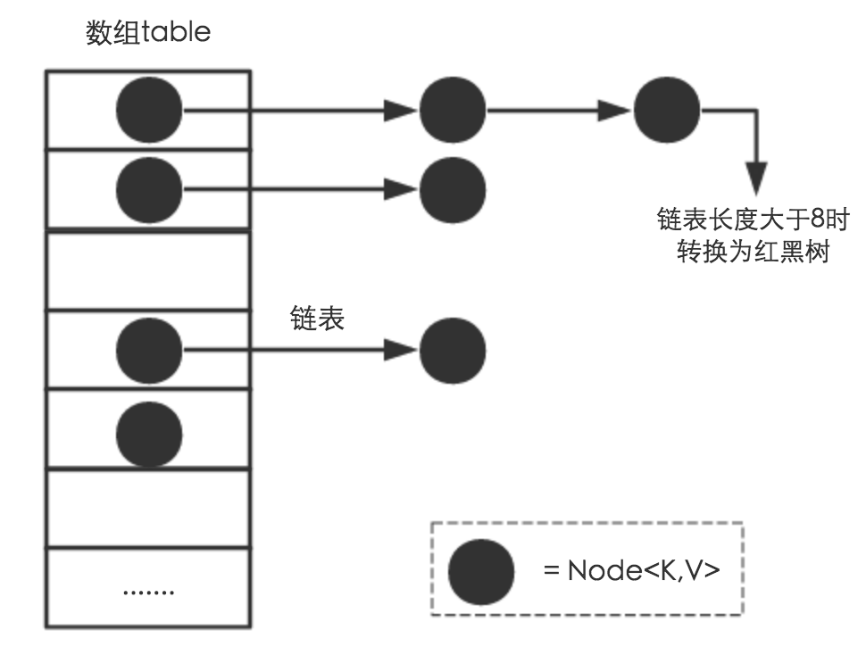

# HashSet and HashMap(JDK8)

Java 8系列之重新认识HashMap
https://tech.meituan.com/java-hashmap.html

# 总体介绍
之所以把*HashSet*和*HashMap*放在一起讲解，是因为二者在Java里有着相同的实现，前者仅仅是对后者做了一层包装，也就是说***HashSet*里面有一个*HashMap*（适配器模式）**。因此本文将重点分析*HashMap*。

*HashMap*实现了*Map*接口，即允许放入`key`为`null`的元素，也允许插入`value`为`null`的元素；除该类未实现同步外，其余跟`Hashtable`大致相同；跟*TreeMap*不同，该容器不保证元素顺序，根据需要该容器可能会对元素重新哈希，元素的顺序也会被重新打散，因此不同时间迭代同一个*HashMap*的顺序可能会不同。
根据对冲突的处理方式不同，哈希表有两种实现方式，一种开放地址方式（Open addressing），另一种是冲突链表方式（Separate chaining with linked lists）。**Java *HashMap*采用的是冲突链表方式**。



从上图容易看出，如果选择合适的哈希函数，`put()`和`get()`方法可以在常数时间内完成。但在对*HashMap*进行迭代时，需要遍历整个table以及后面跟的冲突链表。因此对于迭代比较频繁的场景，不宜将*HashMap*的初始大小设的过大。

有两个参数可以影响*HashMap*的性能：初始容量（inital capacity）和负载系数（load factor）。初始容量指定了初始`table`的大小，负载系数用来指定自动扩容的临界值。当`entry`的数量超过`capacity*load_factor`时，容器将自动扩容并重新哈希。对于插入元素较多的场景，将初始容量设大可以减少重新哈希的次数。

将对象放入到*HashMap*或*HashSet*中时，有两个方法需要特别关心：`hashCode()`和`equals()`。**`hashCode()`方法决定了对象会被放到哪个`bucket`里，当多个对象的哈希值冲突时，`equals()`方法决定了这些对象是否是“同一个对象”**。所以，如果要将自定义的对象放入到`HashMap`或`HashSet`中，需要*@Override*`hashCode()`和`equals()`方法。

`HashMap：`根据键的hashCode值存储数据；最多只允许一条记录的键为null；
          非线程安全(Collections的synchronizedMap/ConcurrentHashMap得到线程安全Map)

`Hashtable：`线程安全；遗留类不建议在新代码中使用，不需要线程安全的场合可以用HashMap替换，需要线程安全的场合可以用ConcurrentHashMap替换

`LinkedHashMap：`LinkedHashMap是HashMap的一个子类，保存了记录的插入顺序，在用Iterator遍历LinkedHashMap时，先得到的记录肯定是先插入的，也可以在构造时带参数，按照访问次序排序

`TreeMap：`TreeMap实现SortedMap接口，能够把它保存的记录根据键排序，默认是按键值的升序排序，也可以指定排序的比较器，当用Iterator遍历TreeMap时，得到的记录是排过序的

# 内数结构

从结构实现来讲，HashMap是数组+链表+红黑树（JDK1.8增加了红黑树部分）实现的

HashMap就是使用哈希表来存储的。哈希表为解决冲突，可以采用开放地址法和链地址法等来解决问题，Java中HashMap采用了链地址法。链地址法，简单来说，就是数组加链表的结合。在每个数组元素上都一个链表结构，当数据被Hash后，得到数组下标，把数据放在对应下标元素的链表上

如果哈希桶数组很大，即使较差的Hash算法也会比较分散，如果哈希桶数组数组很小，即使好的Hash算法也会出现较多碰撞，所以就需要在空间成本和时间成本之间权衡，其实就是在根据实际情况确定哈希桶数组的大小，并在此基础上设计好的hash算法减少Hash碰撞。那么通过什么方式来控制map使得Hash碰撞的概率又小，哈希桶数组（Node[] table）占用空间又少呢？答案就是好的Hash算法和扩容机制

>Node[] table://哈希桶数组
- length大小必须为2的n次方(一定是合数)

>int threshold;  //所能容纳的最大key-value对
- = table.length * loadFactor
- 超过这个数目就重新resize(扩容)

>final float loadFactor;//负载因子(默认值是0.75)

>int modCount;//记录HashMap内部结构发生变化的次数，主要用于迭代的快速失败

>int size; //HashMap中实际存在的键值对数量

# 方法剖析

## get()

`get(Object key)`方法根据指定的`key`值返回对应的`value`，该方法调用了`getEntry(Object key)`得到相应的`entry`，然后返回`entry.getValue()`。因此`getEntry()`是算法的核心。
算法思想是首先通过`hash()`函数得到对应`bucket`的下标，然后依次遍历冲突链表，通过`key.equals(k)`方法来判断是否是要找的那个`entry`。

上图中`hash(k)&(table.length-1)`等价于`hash(k)%table.length`，原因是*HashMap*要求`table.length`必须是2的指数，因此`table.length-1`就是二进制低位全是1，跟`hash(k)`相与会将哈希值的高位全抹掉，剩下的就是余数了。
```Java
//getEntry()方法
final Entry<K,V> getEntry(Object key) {
	......
	int hash = (key == null) ? 0 : hash(key);
    for (Entry<K,V> e = table[hash&(table.length-1)];//得到冲突链表
         e != null; e = e.next) {//依次遍历冲突链表中的每个entry
        Object k;
        //依据equals()方法判断是否相等
        if (e.hash == hash &&
            ((k = e.key) == key || (key != null && key.equals(k))))
            return e;
    }
    return null;
}
```

## put()

`put(K key, V value)`方法是将指定的`key, value`对添加到`map`里。该方法首先会对`map`做一次查找，看是否包含该元组，如果已经包含则直接返回，查找过程类似于`getEntry()`方法；如果没有找到，则会通过`addEntry(int hash, K key, V value, int bucketIndex)`方法插入新的`entry`，插入方式为**尾部插入**。
```Java
 public V put(K key, V value) {
    return putVal(hash(key), key, value, false, true);
}
final V putVal(int hash, K key, V value, boolean onlyIfAbsent,
                   boolean evict) {
    Node<K,V>[] tab; Node<K,V> p; int n, i;
    if ((tab = table) == null || (n = tab.length) == 0)
        n = (tab = resize()).length;
    if ((p = tab[i = (n - 1) & hash]) == null)
        tab[i] = newNode(hash, key, value, null);
    else {
        Node<K,V> e; K k;
        if (p.hash == hash &&
            ((k = p.key) == key || (key != null && key.equals(k))))
            e = p;
        else if (p instanceof TreeNode)
            e = ((TreeNode<K,V>)p).putTreeVal(this, tab, hash, key, value);
        else {
            for (int binCount = 0; ; ++binCount) {
                if ((e = p.next) == null) {
                    p.next = newNode(hash, key, value, null);
                    if (binCount >= TREEIFY_THRESHOLD - 1) // -1 for 1st
                        treeifyBin(tab, hash);
                    break;
                }
                if (e.hash == hash &&
                    ((k = e.key) == key || (key != null && key.equals(k))))
                    break;
                p = e;
            }
        }
        if (e != null) { // existing mapping for key
            V oldValue = e.value;
            if (!onlyIfAbsent || oldValue == null)
                e.value = value;
            afterNodeAccess(e);
            return oldValue;
        }
    }
    ++modCount;
    if (++size > threshold)
        resize();
    afterNodeInsertion(evict);
    return null;
}
```


1. 判断键值对数组table[i]是否为空或为null，否则执行resize()进行扩容；
2. 根据键值key计算hash值得到插入的数组索引i，如果table[i]==null，直接新建节点添加，转向⑥，如果table[i]不为空，转向③；
3. 判断table[i]的首个元素是否和key一样，如果相同直接覆盖value，否则转向④，这里的相同指的是hashCode以及equals；
4. 判断table[i] 是否为treeNode，即table[i] 是否是红黑树，如果是红黑树，则直接在树中插入键值对，否则转向⑤；
5. 遍历table[i]，判断链表长度是否大于8，大于8的话把链表转换为红黑树，在红黑树中执行插入操作，否则进行链表的插入操作；遍历过程中若发现key已经存在直接覆盖value即可；
6. 插入成功后，判断实际存在的键值对数量size是否超多了最大容量threshold，如果超过，进行扩容

## 根据key获取哈希桶数组索引位置（hash算法）

元素位置尽量分布均匀，尽量使得每个位置上的元素数量只有一个，可以用hash算法求得这个位置，不用遍历链，表优化了查询的效率

HashMap定位数组索引位置，直接决定了hash方法的离散性能

```java
方法一：
static final int hash(Object key) {   //jdk1.8 & jdk1.7
     int h;
     // h = key.hashCode() 为第一步 取hashCode值
     // h ^ (h >>> 16)  为第二步 高位参与运算
     return (key == null) ? 0 : (h = key.hashCode()) ^ (h >>> 16);
}
方法二：
static int indexFor(int h, int length) {  //jdk1.7的源码，jdk1.8没有这个方法，但是实现原理一样的
     //第三步 取模运算:length总是2的n次方时，h & (length-1)运算等价于对length取模
     //也就是h%length，但是&比%具有更高的效率
     return h & (length-1);
}
```
`1.取key的hashCode值`

`2.高位运算` JAVA8 通过hashCode()的高16位异或低16位实现，主要是从速度、功效、质量来考虑的


`3.取模运算`

## remove()

`remove(Object key)`的作用是删除`key`值对应的`entry`，该方法的具体逻辑是在`removeEntryForKey(Object key)`里实现的。`removeEntryForKey()`方法会首先找到`key`值对应的`entry`，然后删除该`entry`（修改链表的相应引用）。查找过程跟`getEntry()`过程类似。

```Java
//removeEntryForKey()
final Entry<K,V> removeEntryForKey(Object key) {
	......
	int hash = (key == null) ? 0 : hash(key);
    int i = indexFor(hash, table.length);//hash&(table.length-1)
    Entry<K,V> prev = table[i];//得到冲突链表
    Entry<K,V> e = prev;
    while (e != null) {//遍历冲突链表
        Entry<K,V> next = e.next;
        Object k;
        if (e.hash == hash &&
            ((k = e.key) == key || (key != null && key.equals(k)))) {//找到要删除的entry
            modCount++; size--;
            if (prev == e) table[i] = next;//删除的是冲突链表的第一个entry
            else prev.next = next;
            return e;
        }
        prev = e; e = next;
    }
    return e;
}
```

## 扩容过程
`先插入再检查是否需要扩容` 下面我们讲解下JDK1.8做了哪些优化。经过观测可以发现，我们使用的是2次幂的扩展(指长度扩为原来2倍)，所以，元素的位置要么是在原位置，
要么是在原位置再移动2次幂的位置。看下图可以明白这句话的意思，n为table的长度，图（a）表示扩容前的key1和key2两种key确定索引位置的
示例，图（b）表示扩容后key1和key2两种key确定索引位置的示例，其中hash1是key1对应的哈希与高位运算结果


元素在重新计算hash之后，因为n变为2倍，那么n-1的mask范围在高位多1bit(红色)，因此新的index就会发生这样的变化：
因此，我们在扩充HashMap的时候，不需要像JDK1.7的实现那样重新计算hash，只需要看看原来的hash值新增的那个bit是1还是0就好了，是0的话索引没变，是1的话索引变成“原索引+oldCap”


```java
final Node<K,V>[] resize() {
    Node<K,V>[] oldTab = table;
    int oldCap = (oldTab == null) ? 0 : oldTab.length;
    int oldThr = threshold;
    int newCap, newThr = 0;
    if (oldCap > 0) {
        if (oldCap >= MAXIMUM_CAPACITY) {
            threshold = Integer.MAX_VALUE;
            return oldTab;
        }
        else if ((newCap = oldCap << 1) < MAXIMUM_CAPACITY && oldCap >= DEFAULT_INITIAL_CAPACITY)
            newThr = oldThr << 1; // 翻倍数据容量threshold
    }
    else if (oldThr > 0) // initial capacity was placed in threshold
        newCap = oldThr;
    else {               // zero initial threshold signifies using defaults
        newCap = DEFAULT_INITIAL_CAPACITY;
        newThr = (int)(DEFAULT_LOAD_FACTOR * DEFAULT_INITIAL_CAPACITY);
    }
    if (newThr == 0) {
        float ft = (float)newCap * loadFactor;
        newThr = (newCap < MAXIMUM_CAPACITY && ft < (float)MAXIMUM_CAPACITY ?(int)ft : Integer.MAX_VALUE);
    }
    threshold = newThr;
    @SuppressWarnings({"rawtypes","unchecked"})
    Node<K,V>[] newTab = (Node<K,V>[])new Node[newCap];
    table = newTab;
    if (oldTab != null) {//重新计算hash，重新分布旧的数据
        for (int j = 0; j < oldCap; ++j) {
            Node<K,V> e;
            if ((e = oldTab[j]) != null) {
                oldTab[j] = null;
                if (e.next == null)
                    newTab[e.hash & (newCap - 1)] = e;
                else if (e instanceof TreeNode)
                    ((TreeNode<K,V>)e).split(this, newTab, j, oldCap);
                else { // preserve order
                    Node<K,V> loHead = null, loTail = null;
                    Node<K,V> hiHead = null, hiTail = null;
                    Node<K,V> next;
                    do {
                        next = e.next;
                        if ((e.hash & oldCap) == 0) {
                            if (loTail == null)
                                loHead = e;
                            else
                                loTail.next = e;
                            loTail = e;
                        }
                        else {
                            if (hiTail == null)
                                hiHead = e;
                            else
                                hiTail.next = e;
                            hiTail = e;
                        }
                    } while ((e = next) != null);
                    if (loTail != null) {
                        loTail.next = null;
                        newTab[j] = loHead;
                    }
                    if (hiTail != null) {
                        hiTail.next = null;
                        newTab[j + oldCap] = hiHead;
                    }
                }
            }
        }
    }
    return newTab;
}
```

## 为啥不安全
图说HashMap多线程并发问题分析
https://yq.aliyun.com/articles/66683?spm=5176.8091938.0.0.imGNtZ

1. 死循环：JDK8没有这个问题，JDK7由于resize的时候针对链表的转移是倒序，每次都会将顺序倒转，所以在多线程的情况下可能会出现在循环链，导致死循环

2. fail-fast：如果在使用迭代器的过程中有其他线程修改了map，那么将抛出ConcurrentModificationException，这就是所谓fail-fast策略

3. 造成数据丢失：两个线程同时resize的时候:
```
两个线程A,B都执行了(系统将以最后的为准B)： table = newTab;
两个线程在转移链表的时候会变量oldTab（都指向原table），然后A做oldTab[j]=null的操作后，B再去检查的时候就丢失了这个数据
```

# HashSet

前面已经说过*HashSet*是对*HashMap*的简单包装，对*HashSet*的函数调用都会转换成合适的*HashMap*方法，因此*HashSet*的实现非常简单，只有不到300行代码。这里不再赘述。
```Java
//HashSet是对HashMap的简单包装
public class HashSet<E>
{
	......
	private transient HashMap<E,Object> map;//HashSet里面有一个HashMap
    // Dummy value to associate with an Object in the backing Map
    private static final Object PRESENT = new Object();
    public HashSet() {
        map = new HashMap<>();
    }
    ......
    public boolean add(E e) {//简单的方法转换
        return map.put(e, PRESENT)==null;
    }
    ......
}
```

