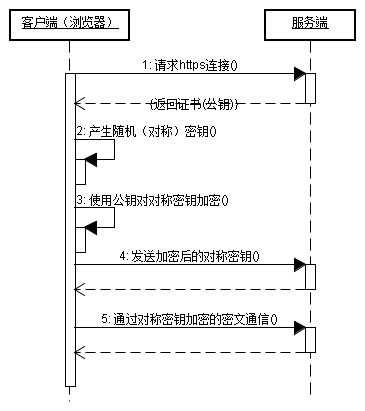

## 常用的HTTP头
### http请求中的常用头（请求头）的含义：

Accept：告诉服务器，客户端可接受的MIME类型

Accept-Charset：告诉服务器，客户端支持哪种字符集

Accept-Encoding：告诉服务器，客户机支持的数据压缩格式,比如gzip

Accept-Language：告诉服务器，客户机的语言环境。浏览器所希望的语言种类，当服务器能够提供一种以上的语言版本时要用到。可以在浏览器中进行设置

Host：客户机通过这个头告诉服务器，想访问的主机名。

If-Modified-Since:客户机通过这个头告诉服务器，资源的缓存时间。

Referer:客户机通过这个头告诉服务器，它是从哪个资源来访问服务器的。（一般用于防盗链）

User-Agent:客户机通过这个头告诉服务器，客户机的软件环境。

Cookie：客户机通过这个头告诉服务器，可以向服务器带数据。

Connection：客户机通过这个头告诉服务器，请求完后是关闭还是保持链接。

Date：客户机通过这个头告诉服务器，客户机当前请求时间。

Content-Type: 请求的与实体对应的MIME信息,如Content-Type: application/x-www-form-urlencoded,上传文件必须要的头:multipart/form-data

Content-Length:请求的内容长度

### http请求中常用的响应头的含义：

Location:这个头配合302状态码使用，告诉用户端找谁。

Server:服务器通过这个头，告诉浏览器服务器的类型

Content-Encoding:服务器通过这个头，告诉浏览器数据采用的压缩格式。

Content-Length:服务器通过这个头，告诉浏览器回送数据的长度。

Content-Language：服务器通过这个头，告诉服务器的语言环境。

Content-Type:服务器通过这个头，回送数据的类型

Last-Modified:服务器通过这个头，告诉浏览器当前资源的缓存时间。

Refresh:服务器通过这个头，告诉浏览器隔多长时间刷新一次。

Content-Disposition:服务器通过这个头，告诉浏览器以下载的方式打开数据。

Transfer-Encoding:服务器通过这个头，告诉浏览器数据的传送格式。

ETag:与缓存相关的头。

Expires:服务器通过这个头，告诉浏览器把回送的数据缓存多长时间。-1或0不缓存。

Cache-Control和Pragma：服务器通过这个头，也可以控制浏览器不缓存数据。

Connection:服务器通过这个头，响应完是保持链接还是关闭链接。

Date:告诉客户机，返回响应的时间

## HTTP与HTTPS的区别

### HTTPS的工作原理
1. 客户使用https的URL访问Web服务器，要求与Web服务器建立SSL连接。
1. Web服务器收到客户端请求后，会将网站的证书信息（证书中包含公钥）传送一份给客户端。
1. 客户端的浏览器与Web服务器开始协商SSL连接的安全等级，也就是信息加密的等级。
1. 客户端的浏览器根据双方同意的安全等级，建立会话密钥，然后利用网站的公钥将会话密钥加密，并传送给网站。
1. Web服务器利用自己的私钥解密出会话密钥。
1. Web服务器利用会话密钥加密与客户端之间的通信

#### HTTPS的优点
尽管HTTPS并非绝对安全，掌握根证书的机构、掌握加密算法的组织同样可以进行中间人形式的攻击，但HTTPS仍是现行架构下最安全的解决方案，主要有以下几个好处：

1. 使用HTTPS协议可认证用户和服务器，确保数据发送到正确的客户机和服务器；
1. HTTPS协议是由SSL+HTTP协议构建的可进行加密传输、身份认证的网络协议，要比http协议安全，可防止数据在传输过程中不被窃取、改变，确保数据的完整性。
1. HTTPS是现行架构下最安全的解决方案，虽然不是绝对安全，但它大幅增加了中间人攻击的成本。
1. 谷歌曾在2014年8月份调整搜索引擎算法，并称“比起同等HTTP网站，采用HTTPS加密的网站在搜索结果中的排名将会更高”。

#### HTTPS的缺点
虽然说HTTPS有很大的优势，但其相对来说，还是存在不足之处的：

1. HTTPS协议握手阶段比较费时，会使页面的加载时间延长近50%，增加10%到20%的耗电；
1. HTTPS连接缓存不如HTTP高效，会增加数据开销和功耗，甚至已有的安全措施也会因此而受到影响；
1. SSL证书需要钱，功能越强大的证书费用越高，个人网站、小网站没有必要一般不会用。
1. SSL证书通常需要绑定IP，不能在同一IP上绑定多个域名，IPv4资源不可能支撑这个消耗。
1. HTTPS协议的加密范围也比较有限，在黑客攻击、拒绝服务攻击、服务器劫持等方面几乎起不到什么作用。最关键的，SSL证书的信用链体系并不安全，特别是在某些国家可以控制CA根证书的情况下，中间人攻击一样可行

### HTTPS和HTTP的区别主要如下：
HTTP协议传输的数据都是未加密的，也就是明文的，因此使用HTTP协议传输隐私信息非常不安全，为了保证这些隐私数据能加密传输，于是网景公司设计了SSL（Secure Sockets Layer）
协议用于对HTTP协议传输的数据进行加密，从而就诞生了HTTPS。简单来说，HTTPS协议是由SSL+HTTP协议构建的可进行加密传输、身份认证的网络协议，要比http协议安全

1. https协议需要到ca申请证书，一般免费证书较少，因而需要一定费用。
2. http是超文本传输协议，信息是明文传输，https则是具有安全性的ssl加密传输协议。
3. http和https使用的是完全不同的连接方式，用的端口也不一样，前者是80，后者是443。
4. http的连接很简单，是无状态的；HTTPS协议是由SSL+HTTP协议构建的可进行加密传输、身份认证的网络协议，比http协议安全

### HTTP1.1与HTTP2.0的区别

## 说出前端优化的常见策略
前端性能优化归纳总结篇！！！

http://blog.csdn.net/grandpang/article/details/51329289

1. 减少 http 请求个数, 合并 js,css 代码 (我们把 js 会合一个文件)
1. 静态资源 cdn 加速
1. 反向代理设置缓存, 提高响应速度
1. 使用浏览器缓存, 配置Etag,Expireshttp 头信息
1. 避免重定向