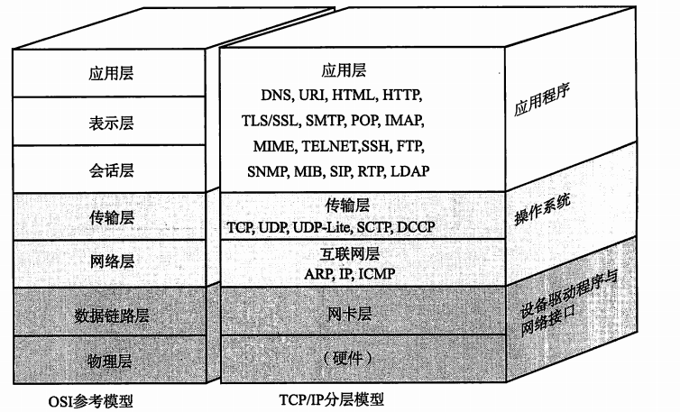
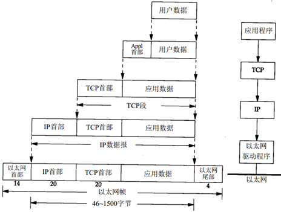
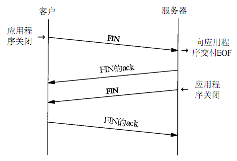
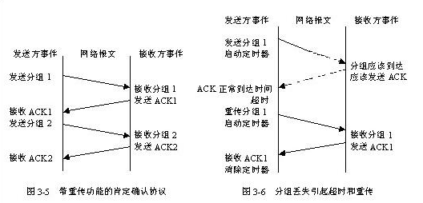
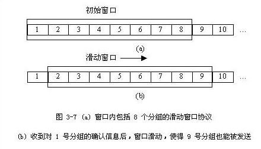

Java.NIO编程一览笔录
https://my.oschina.net/langxSpirit/blog/899954

Java NIO浅析
https://tech.meituan.com/nio.html

《TCP/IP详解》读书笔记
http://www.cnblogs.com/glacierh/p/4854009.html

TCP、UDP、IP 协议分析
http://blog.chinaunix.net/uid-26833883-id-3627644.html

## 四层、每层分别有哪些协议
TCP/IP协议族主要分为四层:应用层、传输层、网络层、数据链路层,每层都有相应的协议，如下图

1. 链路层。也称数据链路层或网络接口层，包括设备驱动程序和网络接口卡，它们一起处理与电缆的物理接口细节。
1. 网络层。处理分组在网络中的活动，如分组的选路；网络层的协议包括IP协议、ICMP协议（Internet互联网控制报文协议）、IGMP协议（Internet组管理协议）。
1. 传输层。主要为两台主机上的应用程序提供端到端的通信，包括TCP（传输控制协议）和UDP（用户数据报协议）。
1. 应用层。处理特定的应用程序细节，DNS,URI,HTTP,TLS/SSL,SMTP,POP,IMAP,Telnet,SSH,FTP等协议

当应用程序用TCP传送数据时，数据被送入协议栈，然后逐个通过每一层直到被当作一串比特流送入网络，其中每一层对收到的数据都要增加一些首部信息

## TCP的三次握手四次挥手

### 三次握手建立连接
1. 请求端(通常称为客户)发送一个SYN段指明客户打算连接的服务器的端口，以及初始序号(ISN,在这个例子中为1415531521)。这个SYN段为报文段1。
1. 服务器发回包含服务器的初始序号的SYN报文段(报文段2)作为应答。同时，将确认序号设置为客户的ISN加1以对客户的SYN报文段进行确认。一个SYN将占用一个序号
1. 客户必须将确认序号设置为服务器的ISN加1以对服务器的SYN报文段进行确认(报文段3)

这三个报文段完成连接的建立。这个过程也称为三次握手(three-way handshake)

可以看到三次握手确定了双方间包的序号、最大接受数据的大小(window)以及MSS(Maximum Segment Size)。

MSS = MTU - IP头 - TCP头,MTU表示最大传输单元，我们在IP头分析的时候会讲到,它一般为1500个字节。IP头和TCP 头部带可选选项的时候都是20个字节。这样的话MSS=1500 - 20 -20 = 1460。

MSS限制了TCP包携带数据的大小,它的意思就是当应用层向传输层提交数据通过TCP协议进行传输时，如果应用层的数据>MSS就必须分段，分成多个段，逐个的发过去。

例如:应用层一次性向传输层提交4096个字节数据，这个时候通过wirshark抓包效果如下:

前三次是三次握手的过程，后面三次是传送数据的过程，由于数据大小是4096个字节，所以用了三次进行传递(1448 + 1448 + 1200)。
细心的人会问为什么每次传送的最大数据大小不是1460个字节呢?因为这里的TCP携带可选项，TCP头长度 = 20 + 12（可选选项大小） = 32字节。 这样能传输的最大数据为:1500 - 20 - 32 = 1448个字节

### 四次挥手断开连接
1. 现在的网络通信都是基于socket实现的，当客户端将自己的socket进行关闭时，内核协议栈会向服务器自动发送一个FIN置位的包，请求断开连接。我们称首先发起断开请求的一方称为主动断开方。
1. 服务器端收到请客端的FIN断开请求后，内核协议栈会立即发送一个ACK包作为应答，表示已经收到客户端的请求
1. 服务器运行一段时间后，关闭了自己的socket。这个时候内核协议栈会向客户端发送一个FIN置位的包，请求断开连接
1. 客户端收到服务端发来的FIN断开请求后，会发送一个ACK做出应答，表示已经收到服务端的请求

### TCP可靠性的保证
TCP采用一种名为“带重传功能的肯定确认（positive acknowledge with retransmission）”的技术作为提供可靠数据传输服务的基础。这项技术要求接收方收到数据之后向源站回送确认信息ACK。发送方对发出的每个分组都保存一份记录，在发送下一个分组之前等待确认信息。发送方还在送出分组的同时启动一个定时器，并在定时器的定时期满而确认信息还没有到达的情况下，重发刚才发出的分组。图3-5表示带重传功能的肯定确认协议传输数据的情况，图3-6表示分组丢失引起超时和重传。为了避免由于网络延迟引起迟到的确认和重复的确认，协议规定在确认信息中稍带一个分组的序号，使接收方能正确将分组与确认关联起来。
从图 3-5可以看出，虽然网络具有同时进行双向通信的能力，但由于在接到前一个分组的确认信息之前必须推迟下一个分组的发送，简单的肯定确认协议浪费了大量宝贵的网络带宽。为此， TCP使用滑动窗口的机制来提高网络吞吐量，同时解决端到端的流量控制

### 滑动窗口技术
滑动窗口技术是简单的带重传的肯定确认机制的一个更复杂的变形，它允许发送方在等待一个确认信息之前可以发送多个分组。如图 3-7所示，发送方要发送一个分组序列，
滑动窗口协议在分组序列中放置一个固定长度的窗口，然后将窗口内的所有分组都发送出去；当发送方收到对窗口内第一个分组的确认信息时，它可以向后滑动并发送下一
个分组；随着确认的不断到达，窗口也在不断的向后滑动

## TCP和UDP的区别
TCP(传输控制协议) 是基于连接的，在正式收发数据之前必须要与对方建立连接，这之间需要经过三次“对话”，首先A主机需要和B主机之间建立数据的收发，
A需要发送一个请求，询问B：“我需要连接”，B收到询问后会给A发送一个回应：“可以连接”，这时A主机得到B主机的回应后，他们之间就建立了连接，就
可以进行数据的传输了。

UDP(用户数报协议)它与TCP相对应的协议，是面向非连接的，不与对方建立连接，直接把数据包发送出去，UDP适用于一次传输少量的数据，对可靠性要求不高
的应用环境，日常生活中使用的ping命令测试两台主机是否通信正常，其原理就是通过UDP实现的。

区别：

TCP ,面相连接，传输可靠，传输大量的数据，但是慢

UDP,面向非连接，传输不可靠，适合传输少量的数据，速度快