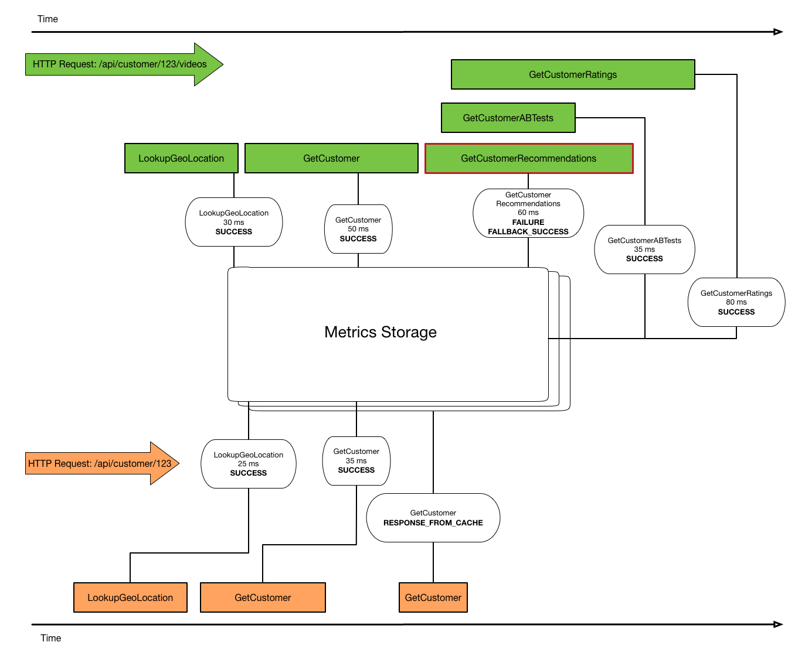

Hystrix [hɪst'rɪks]的中文含义是豪猪

Hystrix总结
http://blog.csdn.net/a298804870/article/details/53427873

Wiki
https://github.com/Netflix/Hystrix/wiki

How To Use
https://github.com/Netflix/Hystrix/wiki/How-To-Use

How it Works
https://github.com/Netflix/Hystrix/wiki/How-it-Works

Configuration
https://github.com/Netflix/Hystrix/wiki/Configuration

## Hystrix

#### Hystrix能做什么
- 在通过第三方客户端访问（通常是通过网络）依赖服务出现高延迟或者失败时，为系统提供保护和控制
- 在分布式系统中防止级联失败
- 快速失败（Fail fast）同时能快速恢复
- 提供失败回退（Fallback）和优雅的服务降级机制
- 提供近实时的监控、报警和运维控制手段

#### Hystrix设计原则
- 防止单个依赖耗尽容器（例如 Tomcat）内所有用户线程
- 降低系统负载，对无法及时处理的请求快速失败（fail fast）而不是排队
- 提供失败回退，以在必要时让失效对用户透明化
- 使用隔离机制（例如『舱壁』/『泳道』模式，熔断器模式等）降低依赖服务对整个系统的影响
- 针对系统服务的度量、监控和报警，提供优化以满足近实时性的要求
- 在 Hystrix 绝大部分需要动态调整配置并快速部署到所有应用方面，提供优化以满足快速恢复的要求
- 能保护应用不受依赖服务的整个执行过程中失败的影响，而不仅仅是网络请求

动态演示：https://design.codelytics.io/hystrix/how-it-works

##### Isolation
Hystrix employs the bulkhead pattern to isolate dependencies from each other and to limit concurrent access to any one of them

THREAD — it executes on a separate thread and concurrent requests are limited by the number of threads in the thread-pool

  coreSize = 10,maximumSize = 10,keepAliveTimeMinutes = 1,maxQueueSize = -1--maxQueueSize<=0?SynchronousQueue:LinkedBlockingQueue(maxQueueSize)

SEMAPHORE — it executes on the calling thread and concurrent requests are limited by the semaphore count

  maxConcurrentRequests=10

##### Calculate Circuit Health
Hystrix reports successes, failures, rejections, and timeouts to the circuit breaker, which maintains a rolling set of counters that calculate statistics.

It uses these stats to determine when the circuit should “trip,” at which point it short-circuits any subsequent requests until a recovery period elapses,
upon which it closes the circuit again after first checking certain health checks.

#### Hystrix实现原理-命令模式
- 将所有请求外部系统（或者叫依赖服务）的逻辑封装到 HystrixCommand或者HystrixObservableCommand（依赖RxJava）对象中
- Run()方法为要实现的业务逻辑，这些逻辑将会在独立的线程中被执行当请求依赖服务时出现拒绝服务、超时或者短路（多个依
赖服务顺序请求，前面的依赖服务请求失败，则后面的请求不会发出）时，执行该依赖服务的失败回退逻辑(Fallback)

#### Hystrix实现原理-舱壁模式
- 货船为了进行防止漏水和火灾的扩散,会将货仓分隔为多个，当发生灾害时，将所在货仓进行隔离就可以降低整艘船的风险。
#### Hystrix实现原理-隔离策略

- 应用在复杂的分布式结构中，可能会依赖许多其他的服务，并且这些服务都不可避免地有失效的可能。如果一个应用没有与依赖服务的失效隔离开来，那么它将有可能因为依赖服务的失效而失效。
- Hystrix将货仓模式运用到了服务调用者上。为每一个依赖服务维护一个线程池（或者信号量），当线程池占满，该依赖服务将会立即拒绝服务而不是排队等待。
- 每个依赖服务都被隔离开来，Hystrix 会严格控制其对资源的占用，并在任何失效发生时，执行失败回退逻辑
#### Hystrix实现原理-观察者模式
- Hystrix通过观察者模式对服务进行状态监听。
- 每个任务都包含有一个对应的Metrics，所有Metrics都由一个ConcurrentHashMap来进行维护，Key是CommandKey.name()
- 在任务的不同阶段会往Metrics中写入不同的信息，Metrics会对统计到的历史信息进行统计汇总，供熔断器以及Dashboard监控时使用
##### Metrics
- Metrics内部又包含了许多内部用来管理各种状态的类，所有的状态都是由这些类管理的
- 各种状态的内部也是用ConcurrentHashMap来进行维护的
##### Metrics如何统计
Metrics在统计各种状态时，时运用滑动窗口思想进行统计的，在一个滑动窗口时间中又划分了若干个Bucket（滑动窗口时间与Bucket成整数倍关系），滑动窗口的移动是以Bucket为单位进行滑动的。
如：HealthCounts 记录的是一个Buckets的监控状态，Buckets为一个滑动窗口的一小部分，如果一个滑动窗口时间为 t ,Bucket数量为 n，那么每t/n秒将新建一个HealthCounts对象
#### Hystrix实现原理-熔断机制
- 熔断是参考电路而产生的一种保护性机制，即系统中如果存在某个服务失败率过高时，将开启熔断器，对于后续的调用，不在继续请求服务，而是进行Fallback操作。
- 熔断所依靠的数据即是Metrics中的HealthCount所统计的错误率
####

## Spring Cloud Hystrix

## 最佳实践